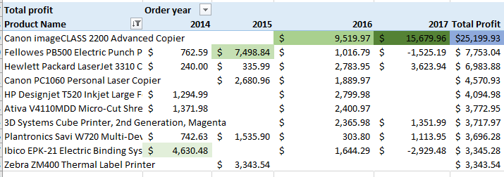

# Analysis-of-sales-data-from-Sample-Superstore.

# The aim of this projectis to analyse the sales activity of Sample superstore over a period of 4 years (2014-2017), with focus on Revenue and profit generation by City, state,region, and Segment. In addition,I'll look at the Profit generatated each year. Is there a growth in the profit generated or decline over the years? What's the Best performing Product based on profit generated? Who is the best customer based on profit generated from this customer? Whats the most frequently used shipping mode? How can Sample Superstore leverage on the frequently used shiping mode for customer retention?

I'll be carrying out this Analysis on Excel, using Pivot Table and Visualization tools.

The first step is to ensure that the data is clean to facilitate accurate result from my analysis.

# Profit and Revenue Generation by City, State,Region, and Segment
Looking at revenue and profit generated in various cities, states , region and from Various segment of the market, I can see that from the top 10 cities, in 4 years, the Highest revenue and Profits geerated by City is from New York City followed by Los Angeles. The state where the highest revenue and profit was generated within this 4 year period is California followed by the state of New york. The region with the highest Revenue and Profit is the West, and the Segment that drove this outcome is the Consumer segment of the market. See Pivot table and Visualization Chart below

     

     

     

     

For further Analysis, Using the Order Year Filter on the Pivot table will reveal the revenue and profits against each parameter(City,State,Region and Segment) for a specified year.

# Profit and Revenue growth Analysis
Theres was a significant growth in revenue and Profit from 2014 to 2017. However, I noticed a decline in revenue in 2015, contrary to the profit side of things that was on the increase from 2014 to 2017. See Pivot Table and Visualization Chart below.

# Best performing Product by Year
In order to see the best performing products based on total profit generated from 2014-2017, I created a Pivot table Showing the top ten products, order years and Total Profit.
I can deduce that the best performing product based on total profit from 2014-2017 is "Canon imageClass2200 Advanced Copier". However, in 2014 it was "Ibico EPK-21 Electric BInding System". In 2015 it was "Fellowes PB500 Electric Punch Plastic Comb Binding Machine with Manual Bind". In 2016 and 2017, it was "Canon imageClass2200 Advanced Copier". See Pivot Table and Visualization chart below.

   

# The Best Customer by Total Profit.
Based on the Total Profit generated from each customer over the period under investigation, the best customer is "Tamara Chand" with a total profit of $8,981.32. followed by "Raymond Buch" with a Total Profit of $6,976.10. However, the best Customer in 2014 and 2017 was "Sanjit Chand" and "Raymond Buch" respectively.

    

The most frequently use Ship mode is the "Standard Class" with 48% subscription, followed by Second Class with 31% subscription by Sample superstore customers. Looking at the Pivot table, the average order processing time for Standard Class is 5 days. Sample Superstore can collaberate with any willing logistics company to shorten the order processing time in order to retain their esteemed customer, who would be glad to have their parcels delivered earlier than expected.

  

